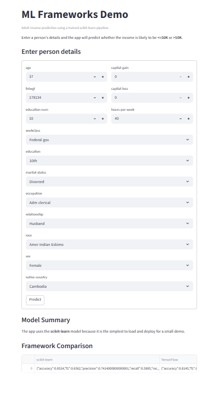

# ML Frameworks Comparison Project

This project compares three machine learning frameworks on the same real-world tabular classification problem:

- scikit-learn
- TensorFlow
- PyTorch

The dataset used is the **Adult Income** dataset from OpenML. The goal is to predict whether a person earns more than $50K per year.

## Project Goals

- Learn and compare three major ML frameworks
- Build a shared preprocessing pipeline
- Train and evaluate models on the same dataset
- Understand accuracy vs recall tradeoffs in imbalanced classification

## Tech Stack

- Python 3.12
- pandas
- scikit-learn
- TensorFlow
- PyTorch
- joblib
- streamlit

## Tech Stack Explained

### Python
Core programming language used to build the entire project.

### pandas
Used for loading, cleaning, and splitting the tabular dataset.

### NumPy
Used for numerical operations and array handling, especially with TensorFlow and PyTorch.

### scikit-learn
Used for preprocessing, the baseline logistic regression model, and evaluation metrics.

### TensorFlow
Used to build and train a neural network with the Keras API.

### PyTorch
Used to build and train a neural network with a manual training loop.

### joblib
Used to save and load the preprocessing pipeline and scikit-learn model.

### Matplotlib
Used for visualizing the ROC curves and comparing model performance.

### Streamlit
Used to build an interactive web application for real-time predictions using the trained model.

- Provides a simple UI for entering input features
- Loads the trained model and preprocessing pipeline
- Displays predictions and probabilities instantly

## Project Structure
ml-frameworks-demo/
├── app/
│   └── streamlit_app.py
├── data/
├── artifacts/
├── reports/
├── src/
│   ├── data.py
│   ├── preprocess.py
│   ├── train_sklearn.py
│   ├── train_tensorflow.py
│   ├── train_pytorch.py
│   ├── compare_models.py
│   └── plot_roc_curves.py
└── README.md

## Setup
Create and activate a virtual environment:

python -m venv .venv
.\.venv\Scripts\Activate.ps1

Install dependencies:

pip install pandas numpy scikit-learn matplotlib seaborn tensorflow torch torchvision torchaudio joblib streamlit

## How to Run
1. Download and split the dataset
    python src\data.py
2. Build the preprocessing pipeline
    python src\preprocess.py
3. Train the scikit-learn model
    python src\train_sklearn.py
4. Train the TensorFlow model
    python src\train_tensorflow.py
5. Train the PyTorch model
    python src\train_pytorch.py
6. Compare all models
    python src\compare_models.py
7. Generate ROC curve comparison
    python src\plot_roc_curves.py

## Results
| Model | Accuracy | Precision | Recall | F1 | ROC-AUC |
|------|----------|----------|--------|-----|---------|
| scikit-learn | 0.8524 | 0.7414 | 0.5885 | 0.6562 | 0.9042 |
| TensorFlow | 0.8145 | 0.5772 | 0.8413 | 0.6847 | 0.9101 |
| PyTorch | 0.8045 | 0.5593 | 0.8631 | 0.6788 | 0.9114 |

---

## Interactive App (Streamlit)

This project includes a Streamlit web application to demonstrate real-time predictions.

### Features

- Input form for user features
- Real-time prediction using trained scikit-learn model
- Probability output for >50K income
- Model comparison summary (scikit-learn vs TensorFlow vs PyTorch)

### Run the app

streamlit run app\streamlit_app.py

The app will open automatically in your browser.

Example Output
    Predicted income class (<=50K or >50K)
    Probability score
    Model comparison table

## App Preview

## Key Takeaways
scikit-learn performed best on overall accuracy and precision.
TensorFlow and PyTorch improved recall for the positive class.
This shows how framework choice and model type can affect the business tradeoff between false positives and false negatives.

## Saved Artifacts
artifacts/preprocessor.joblib
artifacts/sklearn_model.joblib
artifacts/tensorflow_model.keras
artifacts/pytorch_model.pt
artifacts/model_comparison.json

## A strong summary

**Built a tabular classification project using scikit-learn, TensorFlow, and PyTorch on the Adult Income dataset; implemented shared preprocessing, trained and evaluated three models, and compared accuracy, precision, recall, F1, and ROC-AUC to analyze framework tradeoffs on imbalanced data.**